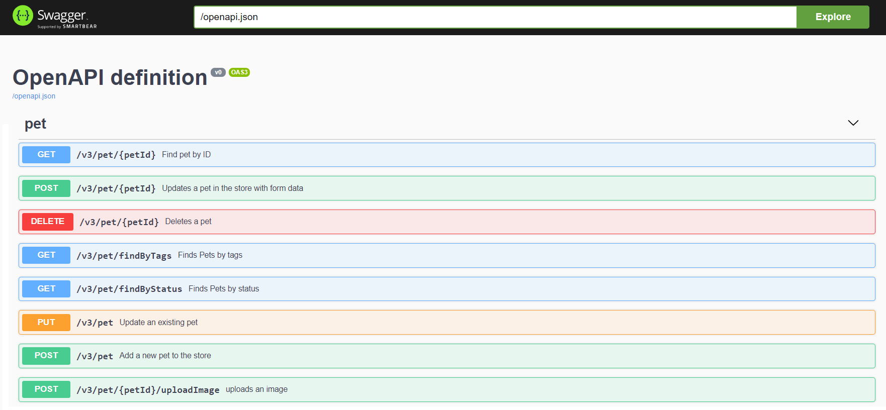
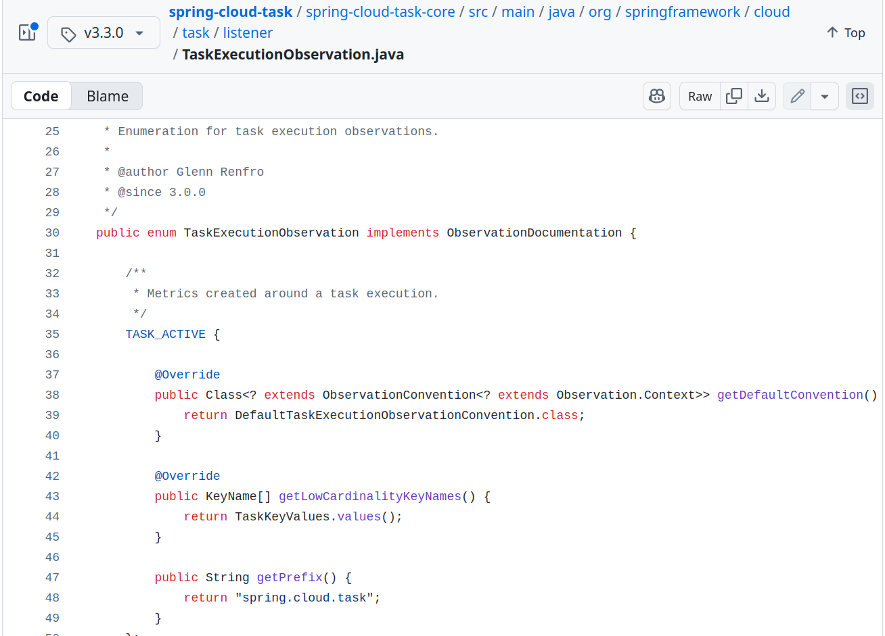
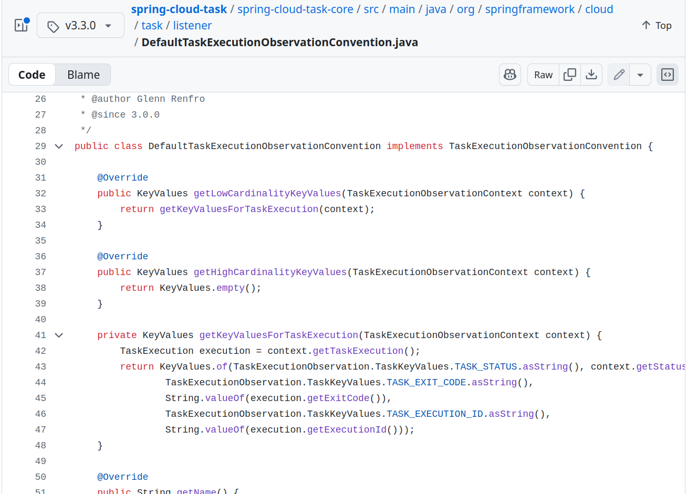
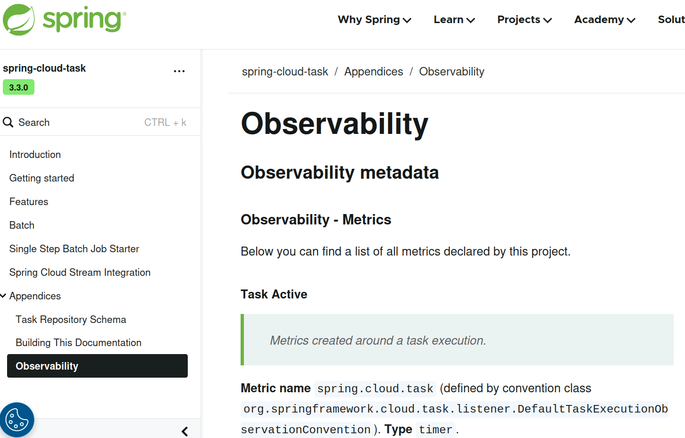

TLDR; Micrometer comes with a project called [Micrometer Docs Generator](https://github.com/micrometer-metrics/micrometer-docs-generator) that is capable of generating documentation directly from your production sources.

<!-- more -->

A lot has been said about [Micrometer](https://micrometer.io) - an observability library for the JVM. It's widely used by the Java community due to it being a core part of the Spring Framework and [Spring Boot](https://docs.spring.io/spring-boot/reference/actuator/observability.html). Other well-known frameworks such as [Quarkus](https://quarkus.io/guides/telemetry-micrometer) also use Micrometer! Not a lot has been said about how Micrometer can help you with your documentation.

#### The Problem

When using an observability framework such as Micrometer one creates observations like the one below.

```java
String name = SomeEnum.ENUM_ENTRY.name(); // This enum has a handful of entries 
String id = generateRandomText(); // Id is a random String value - it can vary a lot
String operationName = "Name [" + name + "] id [" + id + "]" ; 
ObservationRegistry registry = ObservationRegistry.create();
Observation
        .createNotStarted("calculating.tax", registry)
        .contextualName(operationName)
        .lowCardinalityKeyValue("not.varying.value", name)
        .highCardinalityKeyValue("varying.value", id)
        .observe(this::doSomeWorkHere);
```

In this scenario we're making observability a first-class citizen - it lives together with the business code. The `calculating.tax` observation is not designed to be customizable - the name and key-values are fixed. Is it a bad thing? Not really, since we as business developers own this code. If there's any need for customization, we can simply change the code.

So is there any problem here? What if I asked you a couple of questions

- How many observations do you have?
- What are the distributed tracing spans your application produces?
- What are the meters your application produces?

[Micrometer Observation](https://docs.micrometer.io/micrometer/reference/observation.html) works in such a way that out of observations it produces multiple signals. Depending on the setup those can be metrics, traces, logs or anything else that the user sets up via [Observation Handlers](https://docs.micrometer.io/micrometer/reference/observation/components.html#micrometer-observation-handler).

Assuming that you set up metrics and tracing Observation Handlers - are you able to answer the aforementioned questions? Maybe it would be easier to answer if you had any documentation?

#### Who Loves Writing Docs?

According to this [StackOverflow article](https://stackoverflow.blog/2024/12/19/developers-hate-documentation-ai-generated-toil-work/) (which confirms my own observations from the last 15 years), software developers struggle with writing documentation. I remember, around 15 years ago, that we had to document our software in Confluence ("the place where the knowledge dies" :tm:) and copy that text over to the Enterprise Architect as a text label :laughing:.

Writing documentation using [Markdown](https://en.wikipedia.org/wiki/Markdown) was a big step forward - developers could focus on writing actual text and rendering would happen as a separate process. So what was the problem with Markdown at that time? You weren't able to include sources. That means that whenever your documentation referenced code and the code changed, you needed to manually update the docs. If you forgot to do that, your documentation would lie about what it actually does. Example (if `SomeClass` changed then we would need to modify the snippet manually):

```markdown

Some text before including code.

\```java
class SomeClass {

    void hello() {
        // do Sth
    }
}
\```

```

Another tool that changed things around was [Asciidoctor](https://asciidoctor.org/). It allowed you to [include](https://docs.asciidoctor.org/asciidoc/latest/directives/include/) sources. That way you had a single source of truth - your code. E.g. you could write a test, that showed some usage example of your code, then include part of that test in the output documentation. When the code changed, the processed documentation would change but not the documentation sources. Example:

```asciidoc
:sourcedir: ../src/main/java

Some text before including code.

[source,java]
----
include::{sourcedir}/org/asciidoctor/Asciidoctor.java[]
----
```

Ok, is this the final solution to the problem? Not really, we as developers must write the docs ourselves. What if we could shift things around and tell our code to write the docs instead?

#### Let The Tests Write The Docs!

A big eye-opener for me was the fabulous [Spring REST Docs](https://docs.spring.io/spring-restdocs/docs/current/reference/htmlsingle/) project. With REST Docs, you write tests, and the documentation is generated from them! Let's look at the following, simplified, example:

```java
@SpringBootTest
@AutoConfigureRestDocs
@AutoConfigureMockMvc
public class ProducerControllerTests {

	@Autowired
	private MockMvc mockMvc;
	
	@Test
	public void should_grant_a_beer_when_person_is_old_enough() throws Exception {
		PersonToCheck personToCheck = new PersonToCheck(34);

		this.mockMvc.perform(MockMvcRequestBuilders.post("/check")
				.contentType(MediaType.APPLICATION_JSON)
				.content(toJson(personToCheck)))
				.andExpect(jsonPath("$.status").value("OK"))
				.andDo(MockMvcRestDocumentation.document("shouldGrantABeerIfOldEnough"));
	}
    
}
```

This test will verify if our Spring REST API works as intended and at the same time produce snippets that document the API. Instead of us writing the documentation we write the tests that are the source of truth, and after executing them, we get the documentation as output. That's brilliant!

We've managed to go from manually writing the docs with the code snippets (Markdown), to writing our docs manually and having parts of our code included in the docs (Asciidoctor) to producing the documentation from the tests (REST Docs + Asciidoctor). So... are we done? Should I finish this article?

What if we could create the documentation from production sources and not from test execution?

#### Generate Docs From Sources

Generation of docs from test execution is a fantastic way of describing usage examples. In other words we're describing "how things work". You can compare it to a contract in [Contract Tests](https://toomuchcoding.com/tags/spring-cloud-contract/). A contract describes a concrete usage example, not all possible fields that a message can have. The latter is a schema - it describes "what this is". You have a full definition of all possible fields on the way in and out, for HTTP all possible statuses, methods, etc. One way of describing a schema for HTTP messages would be the [OpenAPI Spec](https://swagger.io/specification/).

Let's focus on the OpenAPI scenario with [Spring MVC](https://docs.spring.io/spring-framework/reference/web/webmvc.html). In our production code we are describing what our API should look like by annotating controller classes. We describe all HTTP methods, the statuses, request / response bodies. Then using tools like [SpringDoc](https://springdoc.org/) you can convert the Spring MVC annotations into an OpenAPI specification. Below you have an example of the [Swagger UI](https://swagger.io) that allows us to visualize the Open API spec as interactive forms. If you want to test it yourself, check this [Swagger Petstore example](https://petstore.swagger.io/)(the sources are available [here](https://github.com/swagger-api/swagger-petstore)).



In other words, a REST controller is a blueprint of what the API looks like - it's the source of truth from which the documentation is being built. Can we do something similar with other pieces of our production code - for example, for observability?

#### Observability Blueprints

Let's go back to our Micrometer Observation example. Regardless of whether we're creating a library where [customization of observations](https://docs.micrometer.io/micrometer/reference/observation/components.html#micrometer-observation-convention-example) would make sense or whether we're instrumenting our production code - it would be great to automatically generate documentation of observations directly from the code. With the previously shown approach, scanning sources would be a tedious task because we would have to find all possible method calls of Micrometer API and parse those. What if we operated with conventions instead? Let's look at the following example of calculating tax (snippets taken from [Micrometer documentation](https://docs.micrometer.io/micrometer/reference/observation/components.html#micrometer-observation-convention-example)):

In order to calculate the tax, we need some additional information like `userId` and `taxType` - to store it we can use a dedicated `Observation.Context` implementation.

```java
class TaxContext extends Observation.Context {

    private final String taxType;

    private final String userId;

    TaxContext(String taxType, String userId) {
        this.taxType = taxType;
        this.userId = userId;
    }

    // getters

}
```

To separate instrumentation from the observability "blueprint" (the schema of observations), we can use an `ObservationConvention` mechanism. Below you can see an example where first we defined an `ObservationConvention` extension `TaxObservationConvention` for our dedicated `TaxContext`. Then we implement it to provide defaults through a `DefaultTaxObservationConvention`.

```java
// Interface for an ObservationConvention related to calculating Tax
interface TaxObservationConvention extends ObservationConvention<TaxContext> {

    @Override
    default boolean supportsContext(Observation.Context context) {
        return context instanceof TaxContext;
    }

}

/**
 * Default convention of tags and names related to calculating tax.
 */
class DefaultTaxObservationConvention implements TaxObservationConvention {

    @Override
    public KeyValues getLowCardinalityKeyValues(TaxContext context) {
        return KeyValues.of(TAX_TYPE.withValue(context.getTaxType()));
    }

    @Override
    public KeyValues getHighCardinalityKeyValues(TaxContext context) {
        return KeyValues.of(USER_ID.withValue(context.getUserId()));
    }

    @Override
    public String getName() {
        return "default.tax.name";
    }

    @Override 
    public String getContextualName(TaxContext context) {
        return "Tax [" + context.getTaxType() + "]";
    }

}
```

Before explaining what the `TAX_TYPE` and `USER_ID` enum entries are, let's look at the blueprint. We’re defining, much like in a schema:

- All possible high (e.g. for spans) and low cardinality (e.g. for spans and meters) key-values
- Default observation name (e.g. for meters)
- Default observation contextual name (e.g. for spans)

Can we have a separate blueprint for observation with its key-values? Yes, we can! Let's look at the example below:

```java
enum TaxObservationDocumentation implements ObservationDocumentation {

    /**
     * This javadoc will end up in the docs!
     */
    CALCULATE {
        @Override
        public Class<? extends ObservationConvention<? extends Observation.Context>> getDefaultConvention() {
            return DefaultTaxObservationConvention.class;
        }

        @Override
        public KeyName[] getLowCardinalityKeyNames() {
            return TaxLowCardinalityKeyNames.values();
        }

        @Override
        public KeyName[] getHighCardinalityKeyNames() {
            return TaxHighCardinalityKeyNames.values();
        }
    };

    enum TaxLowCardinalityKeyNames implements KeyName {

        /**
         * This javadoc will end up in the docs!
         */
        TAX_TYPE {
            @Override
            public String asString() {
                return "tax.type";
            }
        }

    }

    enum TaxHighCardinalityKeyNames implements KeyName {

        /**
         * This javadoc will end up in the docs!
         */
        USER_ID {
            @Override
            public String asString() {
                return "tax.user.id";
            }
        }

    }

}
```

In this schema we describe that we will have 1 custom observation `CALCULATE`

- Its default naming and tagging description is available in `DefaultTaxObservationConvention` class. Over there we show what the values for given key-values will be.
- All possible low cardinality key-values are defined in `TaxLowCardinalityKeyNames` enum
- All possible high cardinality key-values are defined in `TaxHighCardinalityKeyNames` enum

Now let's take a look at how the instrumentation code will change:

```java
class TaxCalculator {

    private final ObservationRegistry observationRegistry;

    // If the user wants to override the default they can override this. Otherwise,
    // it will be {@code null}.
    @Nullable
    private final TaxObservationConvention observationConvention;

    TaxCalculator(ObservationRegistry observationRegistry,
            @Nullable TaxObservationConvention observationConvention) {
        this.observationRegistry = observationRegistry;
        this.observationConvention = observationConvention;
    }

    void calculateTax(String taxType, String userId) {
        // Create a new context
        TaxContext taxContext = new TaxContext(taxType, userId);
        // Create a new observation
        TaxObservationDocumentation.CALCULATE
            .observation(this.observationConvention, new DefaultTaxObservationConvention(), () -> taxContext,
                    this.observationRegistry)
            // Run the actual logic you want to observe
            .observe(this::calculateInterest);
    }

    private void calculateInterest() {
        // do some work
    }

}
```

Notice how the instrumentation logic gets simplified! No naming, no tagging isn't present anymore. We simply create an observation using the `ObservationDocumentation` and wrap actual business logic.

Great, but why would that matter? With such an approach customization is simplified because you can provide your own `ObservationConvention` and no instrumentation code needs to change. From the point of view of the documentation generation, it's far easier to parse it. Speaking of the latter, let's now look into the [Micrometer Docs Generator](https://docs.micrometer.io/micrometer-docs-generator/reference/) project.

#### Micrometer Docs Generator - A Hidden Gem

When I was working at the Micrometer team and observability was one of the main themes for Spring Framework and Spring Boot, I was wondering how we could improve the developer experience. Together with the team we concluded that one key feature would be to enable automated documentation generation. To tackle that problem the [Micrometer Docs Generator](https://docs.micrometer.io/micrometer-docs-generator/reference/) project was founded.

The project is a CLI that scans a provided input sources directory to search for `ObservationDocumentation` enum implementations and `ObservationConventions`. By default, it will generate documentation for observations, spans and meters. The project uses [Handlebars templates](https://github.com/micrometer-metrics/micrometer-docs-generator/tree/v1.0.4/micrometer-docs-generator/src/main/resources/templates) and can be completely customized (check the [Picocli options](https://github.com/micrometer-metrics/micrometer-docs-generator/blob/v1.0.4/micrometer-docs-generator/src/main/java/io/micrometer/docs/DocsGeneratorCommand.java)). The project documentation is available [here](https://docs.micrometer.io/micrometer-docs-generator/reference/).

Across the Spring portfolio, we made sure to "eat our own dog food". How could we tell the community that a given solution solves a problem if we don't use it ourselves? That's why many Spring projects were leveraging Micrometer Docs Generator to produce their own observability documentation. You can check out an example of documentation generated for [Spring Cloud Task](https://docs.spring.io/spring-cloud-task/reference/observability.html) and the [sources](https://github.com/spring-cloud/spring-cloud-task/blob/v3.3.0/spring-cloud-task-core/src/main/java/org/springframework/cloud/task/listener/TaskExecutionObservation.java).

Below you can find screenshots from code and part of the generated documentation.








#### Any Other Use Cases?

I have been working as a [consultant](https://toomuchcoding.com/consulting/) for some time now, and for one of my clients I have implemented similar solutions to the one that Micrometer Docs Generator provides. Let me tell you about one such example.

In one project I've created an in-memory eventing system (a simple [Observer](https://en.wikipedia.org/wiki/Observer_pattern) pattern implementation). It's easy to get lost with what types of events does our system send, where are those sent, and who is listening for them. That's why I've implemented a source parser that would create a table with that information. Including the link to Github with the line number where the event was sent and to its respective listener!

#### Summary

In this article I presented my experience with documentation creation. Starting from painful Confluence days, through Markdown, Asciidoctor, generation of docs from tests (Spring REST Docs) and then parsing production code to create docs.

As an example of the latter, I've shown you Micrometer Docs Generator - a hidden gem within the Micrometer portfolio. Even though I'm no longer part of the Spring / Micrometer team, I still try to actively support the community. In case of any questions, do not hesitate to contact the team through their [issue tracker](https://github.com/micrometer-metrics/micrometer-docs-generator/issues).

If you like this article and would like to learn more about my work or would like me to share my experience within your company, check out my [consulting](https://toomuchcoding.com/consulting/) page and [contact](https://toomuchcoding.com/contact/) me!