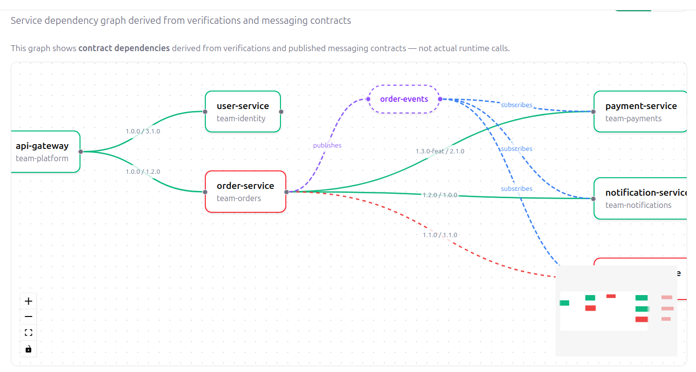
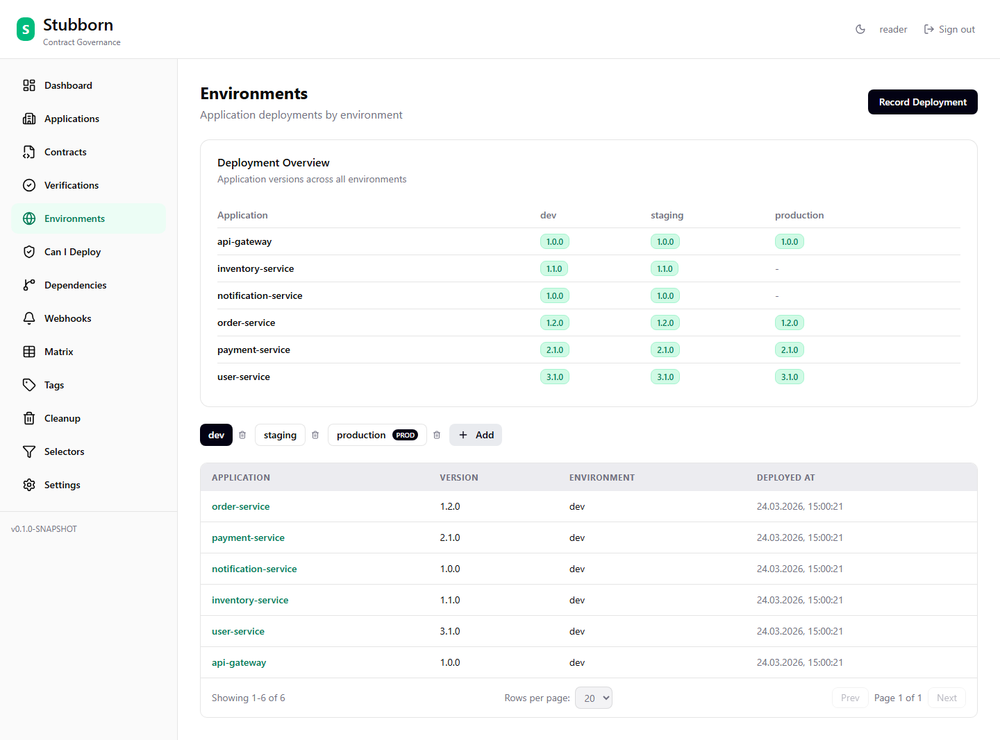
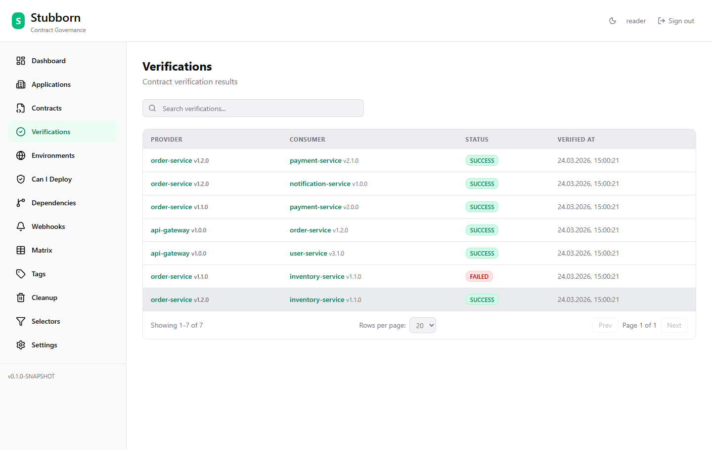

> [!NOTE]
> I'm running a new workshop related to AI and distributed systems. Click [here](https://maven.com/toomuchcoding/generate-break-fix-distributed-systems-in-the-ai-era) to open the workshop page.
   
<!-- more -->

At Spring I/O Barcelona I announced a new project called [Stubborn](https://stubborn.sh). 

[Stubborn](https://stubborn.sh) makes it possible to run a broker for governing Spring Cloud Contract contracts. It can do a lot of other things too!

- Did verifications happen?
- Is it safe to deploy?
- What is the dependency graph?
- Dedicated Maven & Gradle plugins
- Branch-aware can-i-deploy
- Pending contracts (don't block until provider catches up)
- Consumer version selectors
- Content hash deduplication
- Version tags & compatibility matrix
- Full webhooks + retry + history
- CLI (13 commands)
- JS/TS SDK
- Data cleanup & retention policies
- AI traffic-to-contract generation (capture HTTP, get SCC YAML)
- MCP server (AI agents publish, verify & check deployments)
- Maven repository import (migrate existing stubs)
- RBAC + audit log
- SSO / OIDC
- HA deployment support

That's quite a lot of features! [See it for yourself!](https://demo.stubborn.sh)

Check out the website to learn more: [stubborn.sh](https://stubborn.sh). The demo is available under [demo.stubborn.sh](https://demo.stubborn.sh).

Below you can find some screenshots.

